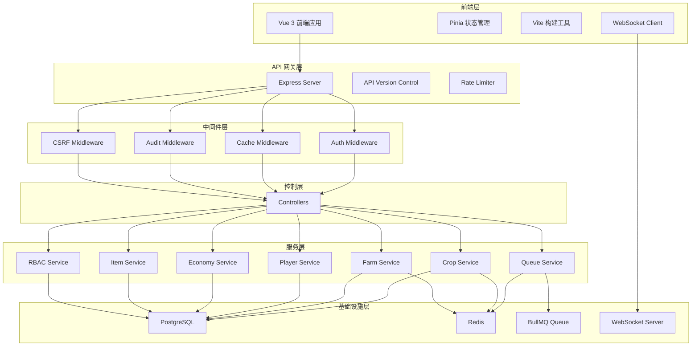
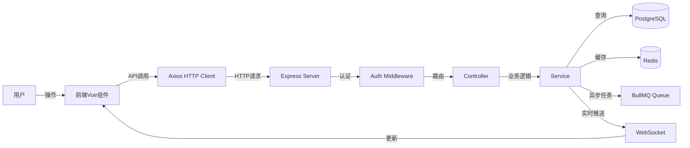
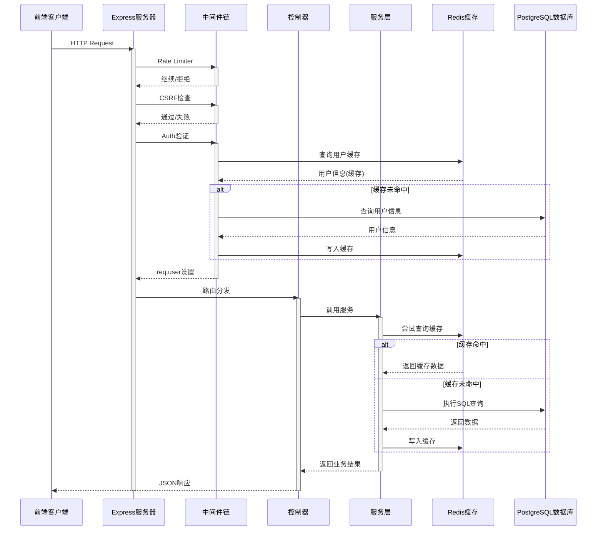
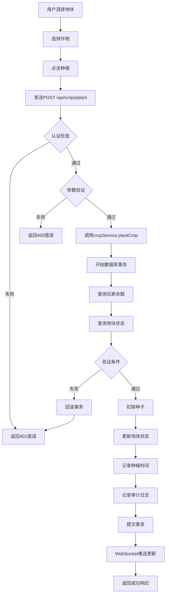
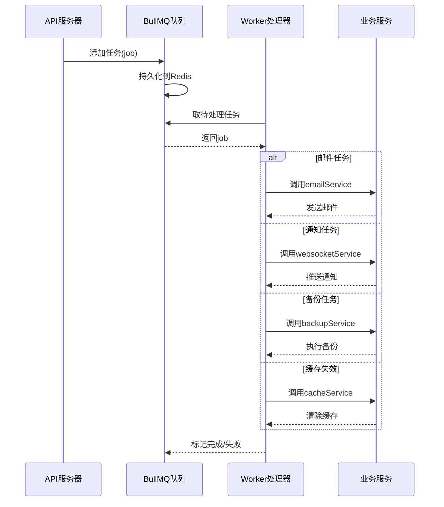
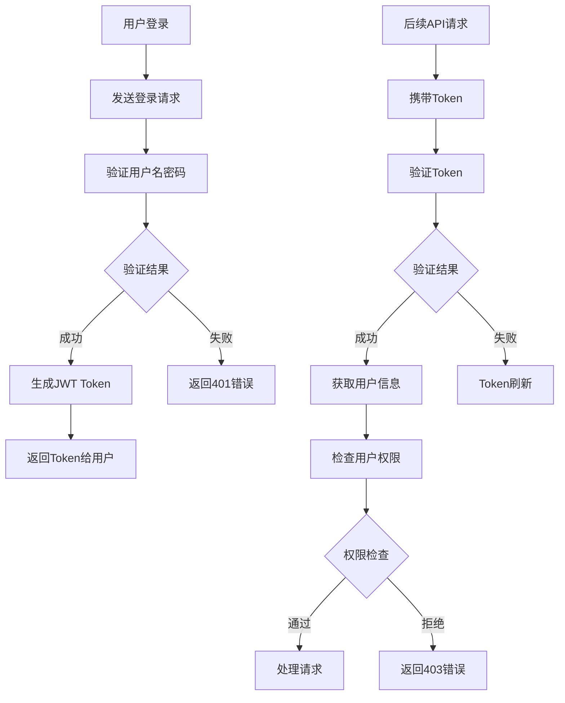
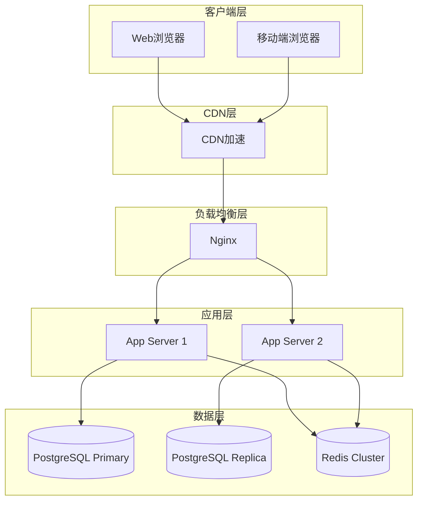

# 系统架构

本文档介绍开心农场项目的整体架构设计。

## 文档信息

- **版本**：v1.2.0
- **日期**：2026-05-21
- **项目版本**：v4.50.0

---

## 概述

开心农场采用前后端分离的架构设计，使用现代化的技术栈构建。

## 整体架构

### 系统架构图

### 前后端数据流图

### 分层架构说明

本项目采用经典的前后端分离架构，主要分为以下几层：

| 层级 | 技术栈 | 职责 |
|------|--------|------|
| **前端层** | Vue 3 + Vite + Pinia | 用户界面、状态管理、路由 |
| **API 网关层** | Express 5 | 路由分发、API版本控制、限流 |
| **中间件层** | Express Middleware | 认证、缓存、审计、CSRF防护 |
| **控制层** | Controllers | 请求处理、参数验证、响应格式化 |
| **服务层** | Services | 业务逻辑、数据处理、事务管理 |
| **基础设施层** | PostgreSQL + Redis + BullMQ | 数据存储、缓存、队列、实时通信 |

---

## 模块交互流程

### HTTP API 请求流程

### 种植-收获流程

### 队列任务处理流程

### 认证与授权流程

---

## 技术栈

### 后端技术栈

| 技术 | 版本 | 用途 |
|------|------|------|
| Node.js | >=18 | 运行环境 |
| Express | ^5.2.1 | Web框架 |
| PostgreSQL | >=14 | 关系型数据库 |
| Redis | >=7 | 缓存/队列存储 |
| BullMQ | ^5.13.0 | 任务队列 |
| Winston | ^3.11.0 | 日志系统 |
| JWT | ^9.0.3 | 认证令牌 |
| Bcrypt | ^6.0.0 | 密码加密 |

### 前端技术栈

| 技术 | 版本 | 用途 |
|------|------|------|
| Vue | ^3.5.30 | 前端框架 |
| Vite | ^8.0.0 | 构建工具 |
| Pinia | ^2.1.7 | 状态管理 |
| Vue Router | ^4.2.5 | 路由 |
| Axios | ^1.13.6 | HTTP客户端 |

### DevOps
- **Docker** - 容器化
- **Docker Compose** - 服务编排
- **GitHub Actions** - CI/CD

---

## 部署架构

### 部署架构图

---

## 扩展性设计

### 水平扩展

- **应用层**：无状态设计，支持横向扩展
- **数据层**：PostgreSQL读写分离 + Redis Cluster
- **缓存层**：Redis分片 + 一致性哈希

### 模块扩展

- **新功能**：新增Controller + Service，遵循现有规范
- **新队列**：在queueService中添加新的处理器
- **新权限**：在RBAC系统中定义新权限

---

## 监控与运维

### 监控指标

- **性能指标**：API响应时间、数据库连接池、Redis命中率
- **业务指标**：在线用户数、农场活跃度、经济数据
- **系统指标**：CPU、内存、磁盘使用率

### 日志系统

使用Winston分级日志：
- error：错误日志
- warn：警告日志
- info：一般信息
- debug：调试信息

---

## 主要模块

### 用户模块
- 用户注册/登录
- JWT 认证
- 双因素认证
- 会话管理

### 农场模块
- 地块管理
- 作物种植
- 收获操作
- 品质提升

### 经济模块
- 货币系统
- 商店功能
- 背包管理

### 成就模块
- 成就检测
- 奖励发放
- 进度追踪

---

## 相关文档

- [数据库设计](./database)
- [DI 容器](./di-container)
- [数据库ER图](./database)
- [Redis监控告警](../tech/monitoring)
- [性能优化](../tech/performance)
