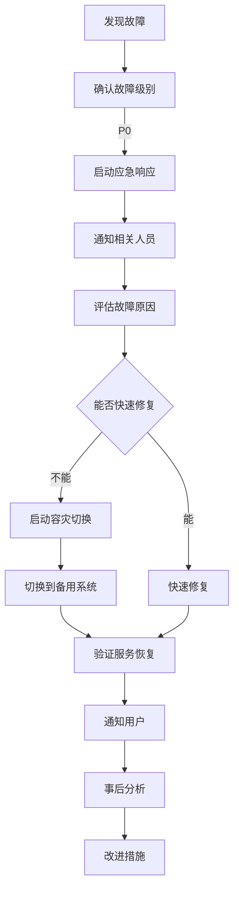

# 🚨 灾难恢复和备份恢复流程

**文档版本**：v4.71.7  
**最后更新**：2026-06-02

---

## 📋 概述

本文档定义了开心农场项目的备份策略、灾难恢复流程和数据恢复步骤，确保在发生故障时能够快速、安全地恢复服务。

---

## 🎯 恢复目标

| 目标 | 说明 | 要求 |
|------|------|------|
| **RPO**（恢复点目标） | 最大可接受数据丢失量 | 1 小时 |
| **RTO**（恢复时间目标） | 最大可接受停机时间 | 4 小时 |

---

## 💾 备份策略

### 1. 数据分类

| 数据类型 | 重要性 | 备份策略 |
|---------|-------|---------|
| 用户数据 | 极高 | 每日完整 + 每小时增量 |
| 游戏数据 | 极高 | 每日完整 + 每小时增量 |
| 配置文件 | 高 | 每日完整 |
| 日志文件 | 中 | 每日完整 |
| 静态资源 | 低 | 每周完整 |

### 2. 备份周期

| 备份类型 | 频率 | 保留期 |
|---------|------|-------|
| 完整备份 | 每日 02:00 | 30 天 |
| 增量备份 | 每小时 | 7 天 |
| 差异备份 | 每周日 | 90 天 |
| 归档备份 | 每月 1 日 | 365 天 |

### 3. 备份位置

| 位置 | 类型 | 用途 |
|------|------|------|
| 本地服务器 | 本地 | 快速恢复 |
| 异地服务器 | 异地 | 灾难恢复 |
| 云存储 | 云 | 长期归档 |

---

## 🗄️ 数据库备份

### 1. PostgreSQL 备份

#### 完整备份脚本

```bash
#!/bin/bash
# pg_backup.sh

BACKUP_DIR="/backup/postgres"
DATE=$(date +%Y%m%d_%H%M%S)
RETENTION_DAYS=30

# 创建备份目录
mkdir -p $BACKUP_DIR

# 执行完整备份
pg_dump -U postgres -Fc happy_farm > $BACKUP_DIR/happy_farm_$DATE.dump

# 压缩备份
gzip $BACKUP_DIR/happy_farm_$DATE.dump

# 删除过期备份
find $BACKUP_DIR -name "happy_farm_*.dump.gz" -mtime +$RETENTION_DAYS -delete

# 上传到云存储
aws s3 cp $BACKUP_DIR/happy_farm_$DATE.dump.gz s3://your-bucket/backups/postgres/

echo "Backup completed: happy_farm_$DATE.dump.gz"
```

#### 增量备份（WAL）

```conf
# postgresql.conf
wal_level = replica
archive_mode = on
archive_command = 'test ! -f /backup/wal/%f && cp %p /backup/wal/%f'
```

### 2. Redis 备份

```bash
#!/bin/bash
# redis_backup.sh

BACKUP_DIR="/backup/redis"
DATE=$(date +%Y%m%d_%H%M%S)

mkdir -p $BACKUP_DIR

# 执行 BGSAVE
redis-cli BGSAVE

# 等待备份完成
while [ ! -f /var/lib/redis/dump.rdb ]; do
    sleep 1
done

# 复制备份文件
cp /var/lib/redis/dump.rdb $BACKUP_DIR/redis_$DATE.rdb
gzip $BACKUP_DIR/redis_$DATE.rdb

# 上传到云存储
aws s3 cp $BACKUP_DIR/redis_$DATE.rdb.gz s3://your-bucket/backups/redis/
```

---

## 📁 文件备份

### 1. 应用文件备份

```bash
#!/bin/bash
# app_backup.sh

BACKUP_DIR="/backup/app"
DATE=$(date +%Y%m%d_%H%M%S)
APP_DIR="/opt/happy-farm"

mkdir -p $BACKUP_DIR

# 备份应用文件（排除 node_modules）
tar -czf $BACKUP_DIR/app_$DATE.tar.gz \
    --exclude='node_modules' \
    --exclude='.git' \
    $APP_DIR

# 上传到云存储
aws s3 cp $BACKUP_DIR/app_$DATE.tar.gz s3://your-bucket/backups/app/
```

### 2. 配置文件备份

```bash
#!/bin/bash
# config_backup.sh

BACKUP_DIR="/backup/config"
DATE=$(date +%Y%m%d_%H%M%S)

mkdir -p $BACKUP_DIR

# 备份配置文件
tar -czf $BACKUP_DIR/config_$DATE.tar.gz \
    /etc/nginx \
    /etc/postgresql \
    /etc/redis \
    /opt/happy-farm/.env*

# 上传到云存储
aws s3 cp $BACKUP_DIR/config_$DATE.tar.gz s3://your-bucket/backups/config/
```

---

## 🔄 自动备份配置

### 1. Cron 配置

```cron
# /etc/crontab

# PostgreSQL 完整备份：每日 02:00
0 2 * * * root /opt/scripts/pg_backup.sh >> /var/log/backup.log 2>&1

# PostgreSQL 增量备份：每小时
0 * * * * root /opt/scripts/pg_wal_backup.sh >> /var/log/backup.log 2>&1

# Redis 备份：每小时
30 * * * * root /opt/scripts/redis_backup.sh >> /var/log/backup.log 2>&1

# 应用备份：每日 03:00
0 3 * * * root /opt/scripts/app_backup.sh >> /var/log/backup.log 2>&1

# 配置备份：每日 04:00
0 4 * * * root /opt/scripts/config_backup.sh >> /var/log/backup.log 2>&1
```

### 2. 备份验证

```bash
#!/bin/bash
# verify_backup.sh

# 验证最近的备份
LATEST_BACKUP=$(ls -t /backup/postgres/*.dump.gz | head -1)

echo "Verifying backup: $LATEST_BACKUP"

# 尝试恢复到临时数据库
gunzip -c $LATEST_BACKUP | pg_restore -U postgres -d temp_verify -c

if [ $? -eq 0 ]; then
    echo "✅ Backup verification successful"
    # 删除临时数据库
    psql -U postgres -c "DROP DATABASE temp_verify;"
else
    echo "❌ Backup verification failed"
    # 发送告警
    curl -X POST https://alert.example.com/backup-failed
fi
```

---

## 🚨 灾难恢复流程

### 1. 故障分类

| 级别 | 说明 | 影响范围 |
|------|------|---------|
| P0 | 系统完全不可用 | 所有用户 |
| P1 | 核心功能不可用 | 大部分用户 |
| P2 | 非核心功能异常 | 部分用户 |
| P3 | 轻微问题 | 少数用户 |

### 2. P0 级灾难恢复流程



### 3. 恢复步骤

#### 步骤 1：故障确认

- [ ] 监控系统告警
- [ ] 手动验证服务状态
- [ ] 收集错误日志
- [ ] 评估影响范围

#### 步骤 2：备份选择

- [ ] 确定恢复时间点
- [ ] 选择最近的完整备份
- [ ] 准备增量备份
- [ ] 验证备份完整性

#### 步骤 3：数据恢复

- [ ] 停止应用服务
- [ ] 恢复数据库
- [ ] 恢复 Redis
- [ ] 恢复配置文件
- [ ] 恢复应用文件

#### 步骤 4：服务启动

- [ ] 启动数据库
- [ ] 启动 Redis
- [ ] 启动后端服务
- [ ] 启动前端服务
- [ ] 验证功能

#### 步骤 5：验证与测试

- [ ] 数据完整性检查
- [ ] 功能测试
- [ ] 性能测试
- [ ] 安全检查

---

## 🔧 数据恢复操作

### 1. PostgreSQL 恢复

#### 完整恢复

```bash
# 停止应用服务
docker-compose stop backend

# 解压备份
gunzip happy_farm_20260526_020000.dump.gz

# 恢复数据库
pg_restore -U postgres -d happy_farm -c happy_farm_20260526_020000.dump

# 验证数据
psql -U postgres -d happy_farm -c "SELECT COUNT(*) FROM users;"
```

#### 时间点恢复（PITR）

```bash
# 恢复基础备份
pg_basebackup -D /var/lib/postgresql/14/main -X stream -P

# 配置 recovery.conf
standby_mode = 'on'
recovery_target_time = '2026-05-26 14:30:00'
recovery_target_action = 'promote'

# 启动 PostgreSQL
systemctl start postgresql
```

### 2. Redis 恢复

```bash
# 停止 Redis
systemctl stop redis

# 恢复备份
cp /backup/redis/redis_20260526_140000.rdb /var/lib/redis/dump.rdb

# 设置权限
chown redis:redis /var/lib/redis/dump.rdb

# 启动 Redis
systemctl start redis

# 验证数据
redis-cli KEYS "*"
```

### 3. 文件恢复

```bash
# 解压备份
tar -xzf /backup/app/app_20260526_030000.tar.gz -C /

# 恢复配置
tar -xzf /backup/config/config_20260526_040000.tar.gz -C /

# 验证文件
ls -la /opt/happy-farm/
```

---

## 📊 备份监控

### 1. 监控指标

| 指标 | 阈值 | 告警级别 |
|------|------|---------|
| 备份失败 | 连续 2 次 | 高 |
| 备份大小异常 | ±20% | 中 |
| 备份时间过长 | > 2 小时 | 中 |
| 磁盘空间 | < 10% | 高 |

### 2. 告警方式

- **邮件**：ops@your-domain.com
- **短信**：+86-xxx-xxxx-xxxx
- **即时消息**：企业微信/钉钉

---

## 📋 恢复测试

### 1. 测试计划

| 测试类型 | 频率 | 负责人 |
|---------|------|-------|
| 完整恢复测试 | 每季度 | 运维团队 |
| 部分恢复测试 | 每月 | 运维团队 |
| 备份验证 | 每日 | 自动化 |

### 2. 测试报告模板

```markdown
# 恢复测试报告

## 测试信息
- 测试日期：
- 测试人员：
- 测试环境：

## 测试内容
- [ ] PostgreSQL 完整恢复
- [ ] PostgreSQL 时间点恢复
- [ ] Redis 恢复
- [ ] 文件恢复

## 测试结果
- 恢复时间：
- 数据完整性：
- 服务可用性：

## 问题与改进
1.
2.

## 结论
```

---

## 📚 相关文档

- [部署文档](./docker-full.md)
- [安全加固指南](./security-hardening.md)
- [故障排查](./troubleshooting.md)
- [环境变量配置](./environment.md)

---

## 📞 联系方式

- **运维团队**：ops@your-domain.com
- **技术支持**：support@your-domain.com
- **紧急电话**：+86-xxx-xxxx-xxxx

---

**文档版本**：v4.71.7  
**最后更新**：2026-06-02  
**维护**：运维团队
