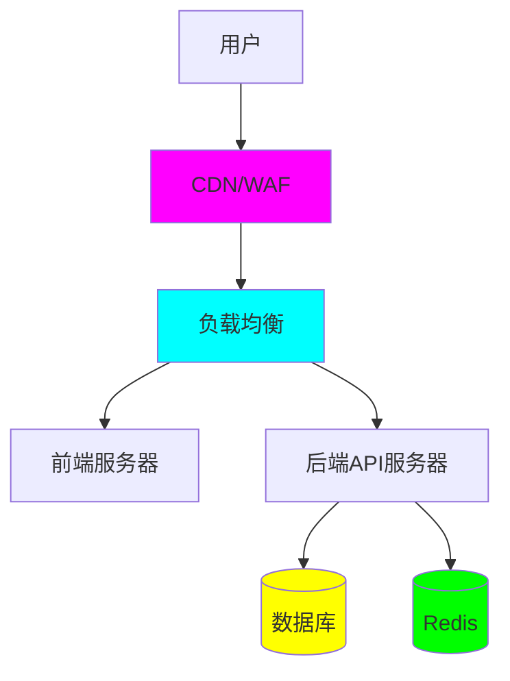
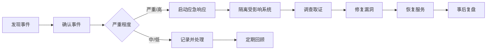

# 🔒 生产环境安全加固指南

**文档版本**：v4.71.7  
**最后更新**：2026-06-02

---

## 📋 概述

本指南提供了开心农场项目生产环境部署的安全加固最佳实践，涵盖网络、应用、数据库、操作系统等多个层面的安全措施。

---

## 🎯 安全加固原则

1. **最小权限原则**：只授予必要的最小权限
2. **纵深防御**：多层安全防护，单一防线失效不影响整体
3. **默认安全**：系统默认配置应是安全的
4. **持续监控**：建立完善的日志和告警机制
5. **定期更新**：及时修复安全漏洞

---

## 🌐 网络安全

### 1. 网络拓扑设计

#### 推荐架构



### 2. 防火墙配置

#### 入站规则

| 端口 | 协议 | 来源 | 说明 |
|------|------|------|------|
| 80 | TCP | 0.0.0.0/0 | HTTP（重定向到 HTTPS） |
| 443 | TCP | 0.0.0.0/0 | HTTPS |
| 22 | TCP | 信任IP | SSH |

#### 出站规则

限制不必要的出站连接，只允许必要的服务访问。

### 3. HTTPS 配置

#### SSL/TLS 证书

- 使用 Let's Encrypt 或商业 CA 证书
- 证书有效期不超过 90 天
- 配置自动续期

#### Nginx 配置示例

```nginx
server {
    listen 443 ssl http2;
    server_name your-domain.com;

    # SSL 配置
    ssl_certificate /path/to/cert.pem;
    ssl_certificate_key /path/to/key.pem;
    
    # TLS 版本
    ssl_protocols TLSv1.2 TLSv1.3;
    ssl_prefer_server_ciphers on;
    
    # HSTS
    add_header Strict-Transport-Security "max-age=31536000; includeSubDomains" always;
    
    # 安全头
    add_header X-Frame-Options "SAMEORIGIN" always;
    add_header X-Content-Type-Options "nosniff" always;
    add_header X-XSS-Protection "1; mode=block" always;
}
```

### 4. WAF（Web 应用防火墙）

推荐配置：
- SQL 注入防护
- XSS 攻击防护
- CSRF 防护
- 文件上传限制
- 速率限制

---

## 💻 应用安全

### 1. 环境变量管理

#### 安全要求

- 生产环境变量不提交到版本控制
- 使用 `.env.production` 文件
- 敏感信息加密存储
- 定期轮换密钥

#### 敏感信息清单

| 信息类型 | 轮换周期 | 说明 |
|---------|---------|------|
| 数据库密码 | 90 天 | PostgreSQL/MySQL |
| Redis 密码 | 90 天 | Redis 认证 |
| JWT 密钥 | 180 天 | 应用密钥 |
| Session 密钥 | 180 天 | 会话密钥 |
| 管理员密码 | 90 天 | 后台管理账户 |

### 2. 认证与授权

#### 密码策略

- 最小长度：8 位
- 包含大小写字母、数字、特殊字符
- 密码过期时间：90 天
- 限制登录失败次数：5 次后锁定 15 分钟

#### 会话管理

- 会话超时：30 分钟无活动
- 启用 HTTPS Only Cookie
- 启用 SameSite Cookie
- 会话固定防护

### 3. 输入验证

所有输入必须经过验证：

| 验证类型 | 说明 |
|---------|------|
| 类型验证 | 验证数据类型（数字、字符串等） |
| 长度限制 | 限制输入长度，防止缓冲区溢出 |
| 格式验证 | 正则表达式验证格式（邮箱、手机号等） |
| 范围验证 | 验证数值范围 |
| 白名单验证 | 只允许已知安全值 |

### 4. 错误处理

生产环境不显示详细错误信息：

```typescript
// 生产环境
if (process.env.NODE_ENV === 'production') {
    app.use((err, req, res, next) => {
        logger.error(err);
        res.status(500).json({
            success: false,
            message: '服务器内部错误'
        });
    });
}
```

---

## 🗄️ 数据库安全

### 1. PostgreSQL 安全配置

#### 用户权限

```sql
-- 创建只读用户
CREATE USER readonly WITH PASSWORD 'strong_password';
GRANT CONNECT ON DATABASE happy_farm TO readonly;
GRANT USAGE ON SCHEMA public TO readonly;
GRANT SELECT ON ALL TABLES IN SCHEMA public TO readonly;

-- 应用用户（最小权限）
CREATE USER app_user WITH PASSWORD 'strong_password';
GRANT CONNECT ON DATABASE happy_farm TO app_user;
GRANT USAGE ON SCHEMA public TO app_user;
GRANT SELECT, INSERT, UPDATE, DELETE ON ALL TABLES IN SCHEMA public TO app_user;
```

#### 网络配置

```conf
# pg_hba.conf
# 只允许应用服务器访问
host    happy_farm    app_user    10.0.0.0/24    scram-sha-256
hostssl happy_farm    app_user    10.0.0.0/24    scram-sha-256
```

#### 加密配置

```conf
# postgresql.conf
password_encryption = scram-sha-256
ssl = on
ssl_cert_file = '/var/lib/postgresql/14/main/server.crt'
ssl_key_file = '/var/lib/postgresql/14/main/server.key'
```

### 2. Redis 安全配置

#### 配置文件

```conf
# redis.conf
bind 127.0.0.1
requirepass your_strong_redis_password
rename-command CONFIG ""
rename-command FLUSHDB ""
rename-command FLUSHALL ""
```

### 3. 数据备份加密

备份文件必须加密：

```bash
# 加密备份
pg_dump happy_farm | gzip | openssl enc -aes-256-cbc -salt -out backup.sql.gz.enc

# 解密恢复
openssl enc -d -aes-256-cbc -in backup.sql.gz.enc | gunzip | psql happy_farm
```

---

## 🔐 操作系统安全

### 1. 用户管理

#### 禁用不必要的用户

```bash
# 锁定不必要的账户
usermod -L games
usermod -L ftp
```

#### Sudo 配置

```bash
# 只允许必要的用户使用 sudo
visudo
```

### 2. SSH 安全

```ssh-config
# /etc/ssh/sshd_config
Protocol 2
PermitRootLogin no
PasswordAuthentication yes
PubkeyAuthentication yes
AllowUsers admin@trusted_ip
Port 2222  # 修改默认端口
```

### 3. 文件权限

```bash
# 设置合理的文件权限
chmod 600 /etc/shadow
chmod 644 /etc/passwd
chmod 700 ~/.ssh
chmod 600 ~/.ssh/id_rsa
```

---

## 📊 安全监控

### 1. 日志收集

#### 重要日志

| 日志类型 | 位置 | 保留期 |
|---------|------|-------|
| 应用日志 | `/var/log/app/` | 90 天 |
| 访问日志 | `/var/log/nginx/` | 90 天 |
| 错误日志 | `/var/log/nginx/` | 180 天 |
| 数据库日志 | `/var/log/postgresql/` | 180 天 |
| 系统日志 | `/var/log/syslog` | 90 天 |

### 2. 入侵检测

推荐工具：
- **Fail2Ban**：防止暴力破解
- **OSSEC**：主机入侵检测
- **Suricata**：网络入侵检测

### 3. 安全告警

| 告警类型 | 触发条件 | 响应级别 |
|---------|---------|---------|
| 多次登录失败 | 5 次/10 分钟 | 高 |
| 异常访问模式 | 非工作时间大量请求 | 中 |
| SQL 注入尝试 | WAF 检测到 | 高 |
| 配置修改 | 敏感配置变更 | 中 |

---

## 🚨 安全事件响应

### 1. 事件分类

| 级别 | 说明 | 响应时间 |
|------|------|---------|
| 严重 | 数据泄露、系统被入侵 | 立即（15分钟内） |
| 高 | 权限提升、敏感数据访问 | 1 小时内 |
| 中 | 配置错误、漏洞暴露 | 4 小时内 |
| 低 | 一般警告、日志异常 | 24 小时内 |

### 2. 响应流程



### 3. 联系方式

- **安全团队**：security@your-domain.com
- **运维团队**：ops@your-domain.com
- **紧急电话**：+86-xxx-xxxx-xxxx

---

## 🔄 定期安全检查

### 1. 检查清单

| 检查项 | 频率 | 负责人 |
|--------|------|-------|
| 系统漏洞扫描 | 每周 | 运维 |
| 应用安全审计 | 每月 | 开发 |
| 渗透测试 | 每季度 | 安全团队 |
| 密码轮换 | 每季度 | 所有人 |
| 备份验证 | 每月 | 运维 |
| 权限审查 | 每月 | 安全团队 |

### 2. 漏洞管理

使用工具：
- **OWASP ZAP**：Web 应用扫描
- **Nmap**：网络扫描
- **OpenVAS**：漏洞扫描

---

## 📚 相关文档

- [部署文档](./docker-full.md)
- [环境变量配置](./environment.md)
- [默认账户与访问地址](../api/default-accounts.md)
- [故障排查](./troubleshooting.md)

---

## 🎓 安全培训

所有开发和运维人员应定期接受安全培训，包括：

- 安全编码规范
- 常见攻击类型
- 应急响应流程
- 数据保护法规

---

**文档版本**：v4.71.7  
**最后更新**：2026-06-02  
**维护**：安全团队 & 运维团队
