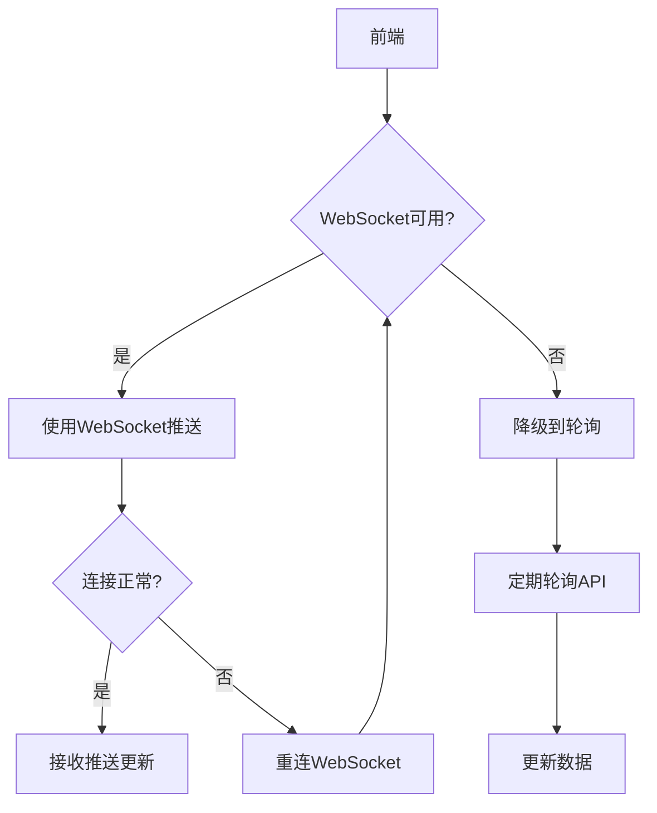

/**
 * 文件名：WebSocket实时推送优化指南.md
 * 作者：TraeAI、xuanyukk
 * 日期：2026-06-01
 * 版本：v4.71.6
 * 功能描述：WebSocket实时推送优化指南
 * 更新记录：
 *   2026-05-01 - v1.0.0 - 初始创建，WebSocket实时推送优化指南
 *   2026-05-06 - v1.1.0 - 更新项目版本信息
 *   2026-05-21 - v4.50.0 - 更新项目版本，统一文档标准
 *   2026-06-01 - v4.71.6 - 同步最新版本
 */

# WebSocket实时推送优化指南

## 概述

本文档说明开心农场项目的WebSocket推送优化方案，采用"WebSocket为主，轮询为备份"的策略。

## 当前现状

### 当前实现
- 已有WebSocket实时推送
- 同时使用轮询作为辅助
- WebSocket连接认证在连接后进行

### 问题
- 服务器压力较大
- 网络波动时连接不稳定
- 无自动降级和重试机制

## 优化方案

### 1. 架构设计



### 2. 优先级策略

#### 主要策略：WebSocket推送（推荐）
- 优点：实时性好、服务器压力小
- 适用场景：稳定的网络环境

#### 备份策略：轮询
- 优点：兼容性好、实现简单
- 适用场景：WebSocket不可用时

### 3. 实现方案

#### 前端实现

```javascript
// webSocketManager.js
class WebSocketManager {
  constructor() {
    this.socket = null
    this.isConnected = false
    this.reconnectAttempts = 0
    this.maxReconnectAttempts = 5
    this.pollingInterval = null
    this.pollingIntervalTime = 30000 // 30秒
  }

  connect() {
    try {
      this.socket = io(process.env.VITE_API_URL || 'http://localhost:3000')
      this.setupEventListeners()
      this.isConnected = true
      this.stopPolling() // 连接成功，停止轮询
    } catch (error) {
      console.error('WebSocket连接失败，开始轮询', error)
      this.startPolling()
    }
  }

  setupEventListeners() {
    this.socket.on('connect', () => {
      console.log('WebSocket已连接')
      this.reconnectAttempts = 0
      this.isConnected = true
      this.stopPolling()
    })

    this.socket.on('disconnect', () => {
      console.log('WebSocket已断开')
      this.isConnected = false
      this.scheduleReconnect()
    })

    this.socket.on('connect_error', () => {
      console.error('WebSocket连接错误')
      this.scheduleReconnect()
    })

    this.socket.on('farmUpdate', (data) => {
      // 处理农场更新
      this.handleUpdate('farm', data)
    })

    this.socket.on('cropUpdate', (data) => {
      // 处理作物更新
      this.handleUpdate('crop', data)
    })
  }

  scheduleReconnect() {
    if (this.reconnectAttempts < this.maxReconnectAttempts) {
      const delay = Math.pow(2, this.reconnectAttempts) * 1000
      console.log(`将在 ${delay}ms 后重连...`)
      setTimeout(() => {
        this.reconnectAttempts++
        this.connect()
      }, delay)
    } else {
      console.error('达到最大重连次数，切换到轮询模式')
      this.startPolling()
    }
  }

  startPolling() {
    if (this.pollingInterval) return
    console.log('开始轮询模式')
    this.pollingInterval = setInterval(() => {
      this.pollForUpdates()
    }, this.pollingIntervalTime)
    // 立即执行一次
    this.pollForUpdates()
  }

  stopPolling() {
    if (this.pollingInterval) {
      clearInterval(this.pollingInterval)
      this.pollingInterval = null
    }
  }

  async pollForUpdates() {
    try {
      const [farmData, cropsData] = await Promise.all([
        api.getFarmData(),
        api.getCropsData()
      ])
      this.handleUpdate('farm', farmData)
      this.handleUpdate('crop', cropsData)
    } catch (error) {
      console.error('轮询失败', error)
    }
  }

  handleUpdate(type, data) {
    // 更新状态
    if (type === 'farm') {
      useFarmStore().updateLands(data)
    } else if (type === 'crop') {
      useCropsStore().updateCrops(data)
    }
  }

  disconnect() {
    if (this.socket) {
      this.socket.disconnect()
    }
    this.stopPolling()
  }
}

export const wsManager = new WebSocketManager()
```

#### 后端优化

```javascript
// 优化后的WebSocket认证（handshake时认证）
io.use(async (socket, next) => {
  try {
    const token = socket.handshake.auth.token 
                   || socket.handshake.headers.authorization?.replace('Bearer ', '')
    
    if (!token) {
      return next(new Error('未提供认证Token'))
    }

    const user = await authService.verifyToken(token)
    socket.user = user
    next()
  } catch (error) {
    next(new Error('认证失败'))
  }
})
```

### 4. 推送策略优化

#### 批量推送
```javascript
// 减少推送频率，合并更新
const pendingUpdates = []
let isScheduled = false

function scheduleUpdate(type, data) {
  pendingUpdates.push({ type, data })
  
  if (!isScheduled) {
    isScheduled = true
    setTimeout(() => {
      flushUpdates()
    }, 100) // 100ms内的更新合并
  }
}

function flushUpdates() {
  if (pendingUpdates.length === 0) return
  
  // 批量推送
  io.emit('batchUpdate', pendingUpdates)
  pendingUpdates.length = 0
  isScheduled = false
}
```

#### 只推送变化
```javascript
// 只发送变化的数据
function sendDiffUpdate(oldData, newData) {
  const diff = computeDiff(oldData, newData)
  if (Object.keys(diff).length > 0) {
    socket.emit('partialUpdate', diff)
  }
}
```

## 配置选项

```javascript
const wsConfig = {
  // 重连配置
  reconnection: true,
  reconnectionAttempts: 5,
  reconnectionDelay: 1000,
  reconnectionDelayMax: 5000,
  
  // 轮询配置（备份）
  pollingInterval: 30000, // 30秒
  fastPollingInterval: 5000, // 重要操作时快速轮询
  
  // 推送配置
  batchUpdateInterval: 100, // 批量推送间隔
}
```

## 优势对比

| 特性 | WebSocket | 轮询 |
|------|-----------|------|
| 实时性 | ⭐⭐⭐⭐⭐ 极佳 | ⭐⭐ 好 |
| 服务器负载 | ⭐⭐⭐⭐⭐ 低 | ⭐⭐ 高 |
| 实现复杂度 | ⭐⭐⭐⭐ 中等 | ⭐⭐⭐ 简单 |
| 兼容性 | ⭐⭐⭐⭐ 好 | ⭐⭐⭐⭐⭐ 极佳 |
| 网络适应性 | ⭐⭐⭐ 好 | ⭐⭐⭐⭐⭐ 极佳 |

## 监控与告警

### 监控指标
- WebSocket连接数
- 消息推送频率
- 推送失败率
- 轮询使用比例

### 告警条件
- 推送失败率 > 5%
- 轮询使用比例 > 30%
- 连接异常增多

## 回滚方案

如果新方案出现问题：
- 快速回退到之前的稳定版本
- 分析问题原因
- 逐步重新引入优化

## 后续优化方向

- 使用WebSocket二进制消息
- 数据压缩传输
- 消息队列缓冲
- 集群负载均衡
